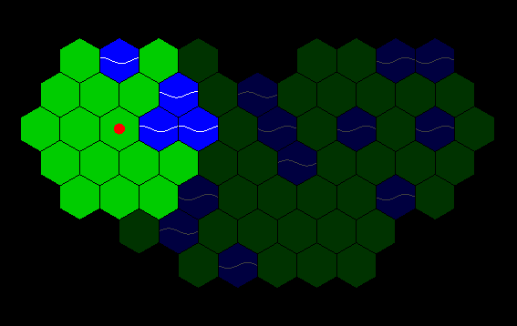

# Hexes

A simple 2D graphics project to experiment with hexagonal tilings, written in Haskell using [Gloss](https://hackage.haskell.org/package/gloss).

* Only the terrain within two hexes of the red dot is directly visible, though previously visited terrain is remembered.
* The red dot can be moved to an adjacent hexagon by clicking on it, though it cannot go into the water.
* This was made by making use of the cube and axial coordinate systems as demonstrated by [Red Blob Games](https://www.redblobgames.com/grids/hexagons/).
